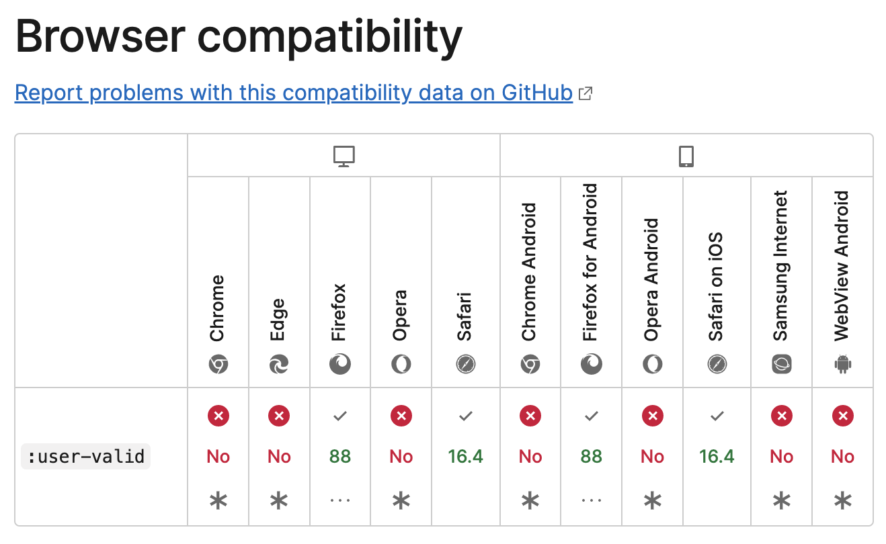

# browser-technologies

## Beschrijving
### Features

## Progressive Enhancement vs Feature Detection



## Testing
### Chrome
Ik maakte gebruik van ```:user-valid``` en ```:user-invalid``` om te kijken of de input velden correct waren ingevuld. Dit werkt niet in Chrome. Ik heb dit opgelost door een custom error message te maken die verschijnt als de input velden niet correct zijn ingevuld.

Ook maak ik gebruik van de ```:has()``` selector. Deze doet het gewoon prima in chrome. 

### Firefox

### Safari

## Demo
[Demo](https://browser-technologies-2021.herokuapp.com/)

## Criteria

- [x]	Student kan de _Core functionaliteit_ van een use case doorgronden
- [x]	Student kan uitleggen wat _Progressive Enhancement_ en _Feature Detection_ is en hoe dit toe te passen in Web Development
- [x]	De demo is opgebouwd in 3 lagen, volgens het principe van _Progressive Enhancement_
- [x]	De user experience van de demo is goed
	-	Let op leesbaarheidsregels, contrast en kleuren
	-	Let op gebruiksvriendelijkheid, zoals affordance en feedback op interactieve elementen
	-	De meest 'enhanced' versie is super vet, gaaf en h-e-l-e-maal te leuk om te gebruiken

Er is een Readme toegevoegd met daarin:
- [x] Een link naar de demo.
- [ ] Een beschrijving van de feature(s)/Browser Technologies die in je demo zijn gebruikt en hoe je dit PE hebt toegepast
- [ ] Een lijst met browsers waarin je hebt getest:
	- voor de desktop: 1 Chromium, Firefox en Safari
	- voor mobiel: Safari iOS + Android: Samsung Internet of Chrome
	- 1 obscure browser naar keuze: Lynx, Flow ([Flow voor Mac](https://flounder.ekioh.com/~piers/ekioh_6.9.0_mac-flow_20230307_r38512.zip) en [Flow voor Linux](https://flounder.ekioh.com/~piers/ekioh_6.9.0_x11-64-flow_20230307_r38512.zip)), PrinceXML of KaiOS 
- [ ]  een testverslag met
	- een beschrijving van de feature-lijst die zijn onderzocht
	- welke browsers de feature(s) wel/niet ondersteunen
	- welke functionaliteiten zoals JavaScript je aan en uit hebt gezet in de tests
	- een screenreader test op de default screenreader van je laptop en/of telefoon.